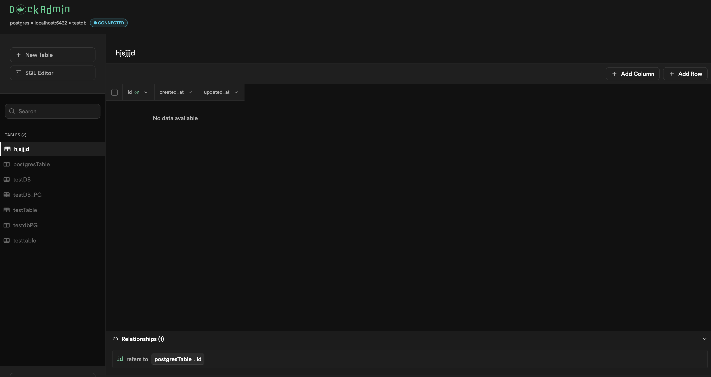
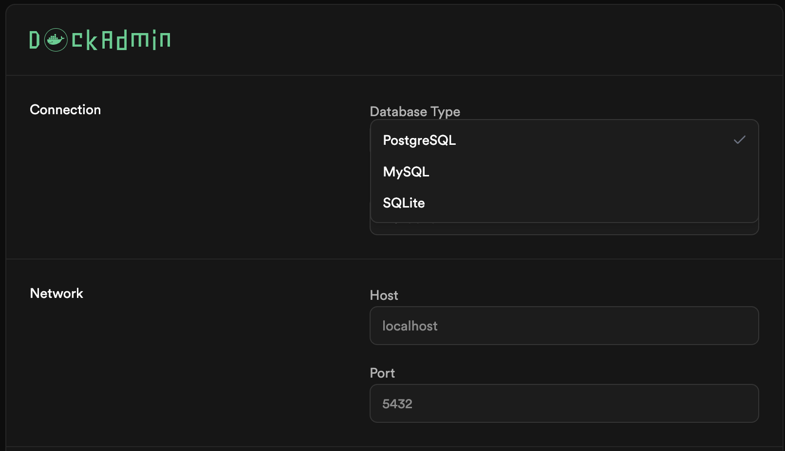
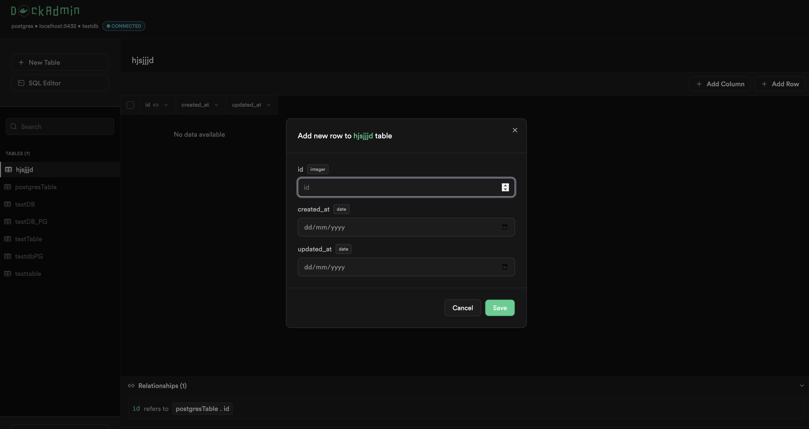
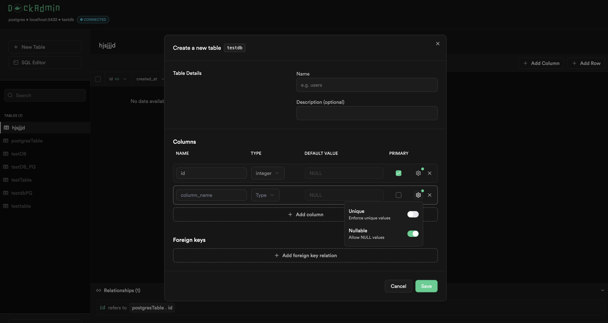
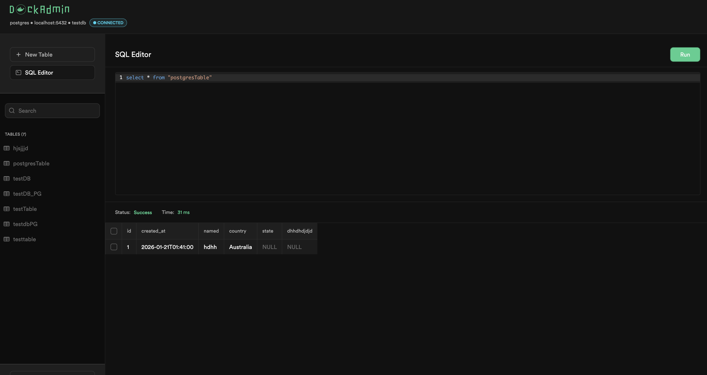
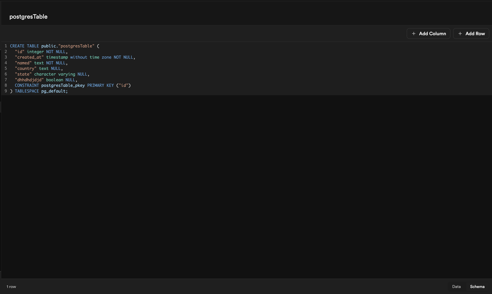
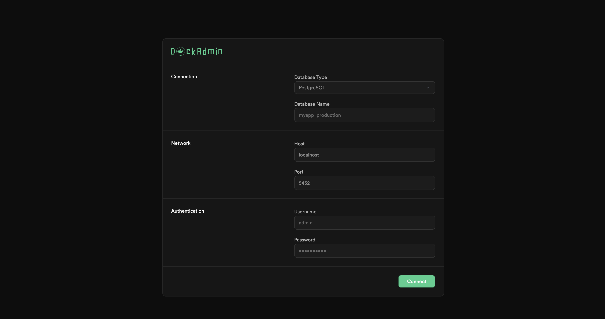

# 

[](LICENSE)
[](https://hub.docker.com/r/demlabz/dockadmin)


> A lightweight, Docker-native database administration UI for developers.



---

## ✨ Features

- 🐘 **Multi-Database Support** — PostgreSQL, MySQL, and SQLite
  
- 🎨 **Modern UI** — Beautiful interface
- 📊 **Visual CRUD** — Browse, insert, edit, and delete data with inline editing
  
  
- 📝 **SQL Editor** — Execute raw SQL queries with syntax highlighting
  
- 🔍 **Schema Viewer** — Explore table structures, indexes, and foreign keys
  
- 🐳 **Docker-First** — Optimized multi-stage build (~15MB image)
- 🔐 **Simple Auth** — Database credentials ARE the authentication (Adminer-style)
  

---

## 🚀 Quick Start

### Add to Your Docker Compose

Add DockAdmin alongside your existing database containers:

```yaml
services:
    # Your existing database
    postgres:
        image: postgres:16
        environment:
            POSTGRES_USER: admin
            POSTGRES_PASSWORD: admin
            POSTGRES_DB: myapp
        # ... your other config

    # Add DockAdmin
    dockadmin:
        image: demlabz/dockadmin
        ports:
            - '3000:3000'
```

Then run:

```bash
docker compose up -d
```

Open [http://localhost:3000](http://localhost:3000) and connect to your database using the container name as the host (e.g., `postgres`).

### Standalone

```bash
docker run -p 3000:3000 demlabz/dockadmin
```

> **Note**: When running standalone, use your database's accessible host/IP to connect.

---

## 🛠️ Development

Want to contribute? See the [Contributing Guide](CONTRIBUTING.md) for development setup instructions.

---

## ⚙️ Configuration

DockAdmin can be configured via environment variables:

| Variable   | Description                          | Default |
| ---------- | ------------------------------------ | ------- |
| `PORT`     | Server port                          | `3000`  |
| `RUST_LOG` | Log level (debug, info, warn, error) | `info`  |

---

## 📚 API Reference

DockAdmin exposes a RESTful API for all database operations.

### Key Endpoints

| Endpoint             | Method | Description             |
| -------------------- | ------ | ----------------------- |
| `/api/connect`       | POST   | Connect to a database   |
| `/api/status`        | GET    | Check connection status |
| `/api/schema/tables` | GET    | List all tables         |
| `/api/table/{name}`  | GET    | Browse table data       |
| `/api/query`         | POST   | Execute raw SQL         |

---

## 🏗️ Tech Stack

| Component         | Technology                            |
| ----------------- | ------------------------------------- |
| **Backend**       | Rust, Axum, SQLx                      |
| **Frontend**      | React 19, TypeScript, TanStack Router |
| **UI Components** | shadcn/ui, Radix UI, Tailwind CSS     |
| **Editor**        | CodeMirror 6                          |
| **Container**     | Docker, Alpine Linux                  |

---

## 🗺️ Roadmap

- [x] PostgreSQL support
- [x] MySQL support
- [x] SQLite support
- [x] CRUD operations
- [x] SQL editor
- [x] Schema viewer
- [ ] Data export (SQL/CSV)
- [ ] Data import
- [ ] Full-text search
- [ ] Connection history
- [ ] Multi-database sessions

---

## 🤝 Contributing

Contributions are welcome! Please read our [Contributing Guide](CONTRIBUTING.md) before submitting a Pull Request.

### Quick Steps

1. Fork the repository
2. Create a feature branch (`git checkout -b feature/amazing-feature`)
3. Commit your changes (`git commit -m 'Add amazing feature'`)
4. Push to the branch (`git push origin feature/amazing-feature`)
5. Open a Pull Request

---

## 📄 License

This project is licensed under the MIT License - see the [LICENSE](LICENSE) file for details.

---

## 🙏 Acknowledgments

- [Adminer](https://www.adminer.org/) — For the inspiration of simple, effective database management
- [shadcn/ui](https://ui.shadcn.com/) — For the beautiful component library

---

<p align="center">
  Made with ❤️ by <a href="https://github.com/Mr-Malomz">Mr-Malomz</a>
</p>
